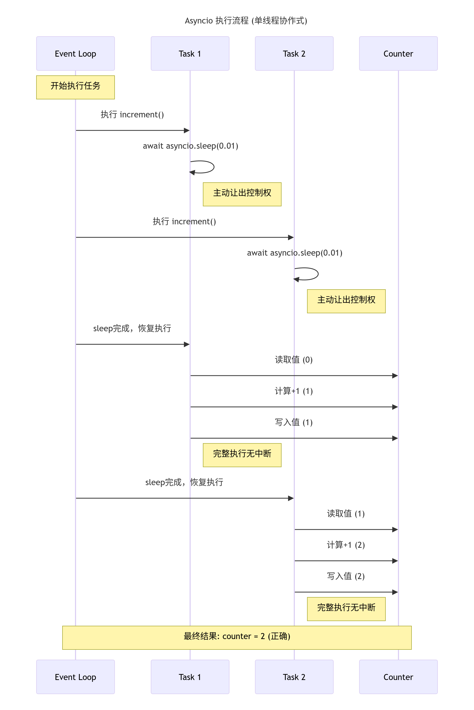
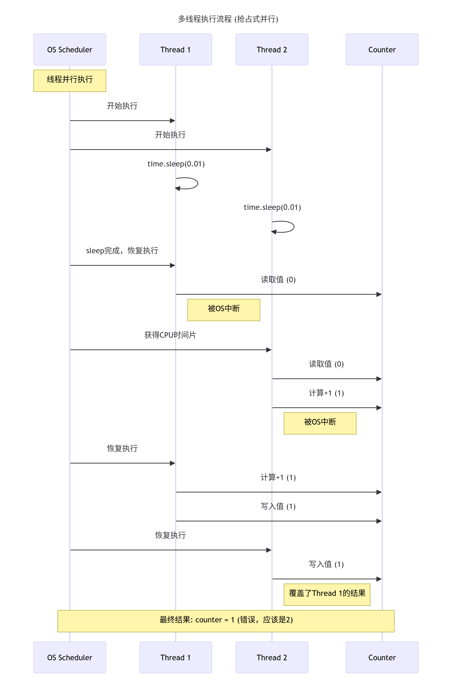

好的，我帮你整理成逐步分析的 markdown 版本，方便阅读和复习 👇

---

# Asyncio 与多线程在计数器递增场景中的行为分析

## 1. 代码与 Asyncio 行为

示例代码（asyncio 版本）：

```python
import asyncio

counter: int = 0

async def increment():
    global counter
    await asyncio.sleep(0.01)
    counter += 1

async def main():
    global counter
    for _ in range(100):
        tasks = [asyncio.create_task(increment()) for _ in range(100)]
        await asyncio.gather(*tasks)
        assert counter == 100
        counter = 0

asyncio.run(main())
```

### 为什么总是 100？

* **单线程事件循环**：asyncio 是单线程的协作式并发，只有一个任务在运行，任务切换只会在 `await` 时发生。
* **关键点**：`counter += 1` 在 `await asyncio.sleep(0.01)` 之后，没有其他 `await`，所以自增语句不会被中断。
* **效果**：尽管 `+=` 本身不是原子操作，但在这个模型下它表现为原子的，因为不会在中途被打断。
* **结果**：每个任务都能完成一次自增，100 个任务后，`counter == 100`。

---

## 2. 多线程版本与问题

多线程实现：

```python
import threading, time

counter: int = 0

def increment():
    global counter
    time.sleep(0.01)  # 模拟耗时
    counter += 1

def main():
    global counter
    for _ in range(100):
        threads = []
        for _ in range(100):
            t = threading.Thread(target=increment)
            t.start()
            threads.append(t)
        for t in threads:
            t.join()
        assert counter == 100, f"Counter is {counter}, expected 100"
        counter = 0

if __name__ == "__main__":
    main()
```

### 为什么可能失败？

* **多线程并行**：线程是操作系统级调度，可抢占式执行，可能并行运行。
* **非原子操作**：`counter += 1` 会拆成多条字节码：读 → 加 1 → 写。
* **竞态条件**：

  * 线程 A 读到 `counter = 0`。
  * 线程 B 也读到 `counter = 0`。
  * A 写回 1，B 也写回 1 → 导致丢失一次递增。
* **结果**：计数器值可能小于 100，例如 95、98 等，断言可能失败。

---

## 3. 实验验证（实际运行结果）

* **Asyncio 版本**：始终输出 `counter == 100`。
* **多线程无锁版本**：多次试验结果在 6–99 之间波动，很少恰好是 100。
* **多线程加锁版本**：使用 `threading.Lock()` 保护 `counter += 1`，始终得到 100。

---

## 4. 核心问题回答

> 如果是多线程，不也应该是 100 吗？

**答案：不是。**

* **asyncio（单线程）**：不会被中断，`counter += 1` 等效为原子操作 → 始终得到 100。
* **多线程（并行执行）**：存在竞态，`counter += 1` 非原子 → 可能丢失更新，结果小于 100。

要保证正确结果，需要同步机制（如锁）。

---

## 5. 修复方法

### 线程安全版本

```python
lock = threading.Lock()

def increment():
    global counter
    time.sleep(0.01)
    with lock:
        counter += 1
```

### 协程安全版本

```python
lock = asyncio.Lock()

async def increment():
    global counter
    await asyncio.sleep(0.01)
    async with lock:
        counter += 1
```

---

## 6. 总结

* **asyncio**：单线程 + 协作式并发，本例安全，但若操作之间存在 `await`，也可能出现竞态。
* **多线程**：并行 + 抢占式调度，`+=` 非原子 → 必须用锁或其他同步机制保证正确性。
* **最佳实践**：避免共享可变状态，或在必要时使用锁/原子操作/消息队列来保证一致性。

---

**对比图（时序图）**




